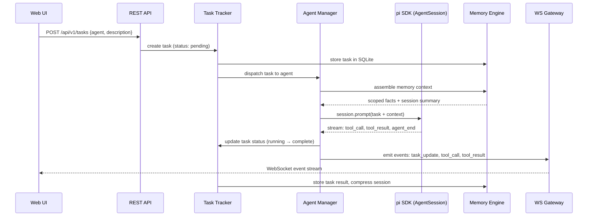
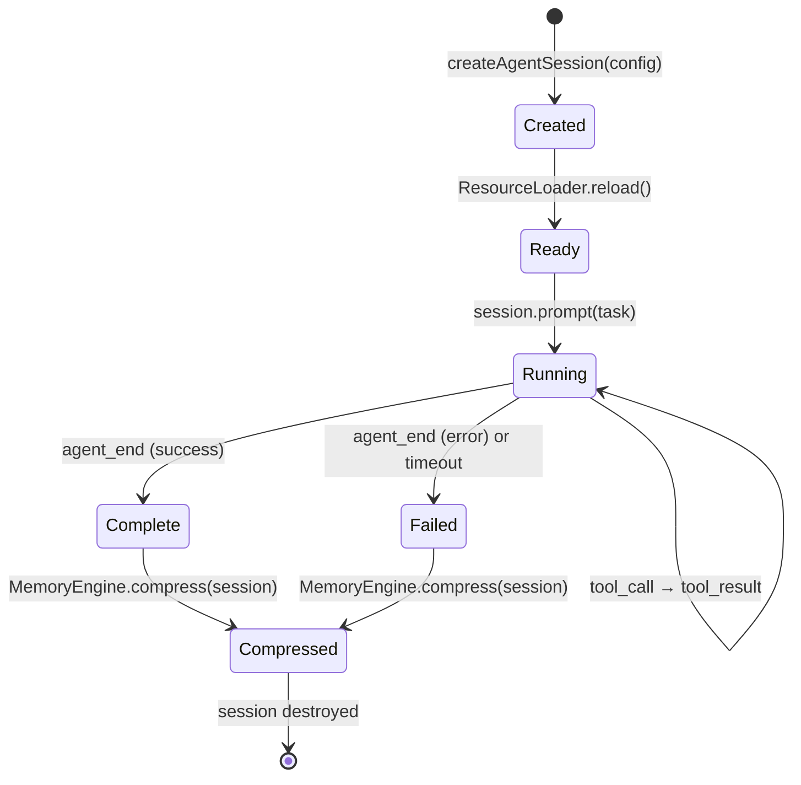

# feat: pragents M1 Core — Agent Foundation

## Summary

Build the M1 foundation of pragents — an agent observability and orchestration sidecar for the pi coding agent. Uses pi's SDK (`createAgentSession()`) to run per-agent sessions in-process, with a SQLite-backed Memory Engine for facts and task tracking, a REST API for task management, and a minimal React/TanStack Web UI for Dashboard and Traces. The design spec's "Bridge + Extension + WebSocket" architecture is replaced by direct SDK integration, eliminating the need for a pi extension or cross-process WebSocket bridge entirely.

---

## Problem Frame

A one-person agency managing multiple client projects needs agents that remember across sessions and tasks that are traceable. Today, each pi session is isolated — no cross-session memory, no task tracking, no observability beyond the terminal. pragents provides a persistent sidecar server that gives agents living memory and gives the human a web dashboard to see what agents are doing.

This plan targets the M1 phase from the design spec: pi integration, Memory Engine, and basic Task tracking — the foundation every subsequent phase (M2 Orchestrate, M3 Observe, M4 Autonomy, M5 Polish) depends on.

---

## Requirements

- **R1.** Agents preserve context across sessions via two-tier memory (short-term LRU cache, long-term SQLite facts)
- **R2.** Tasks are created, dispatched to agents, tracked through lifecycle, and results persisted
- **R3.** Agent activity is observable: tool calls, results, and status streamed to a Web UI
- **R4.** The system runs as a local daemon with embedded databases — no external services required
- **R5.** Agent configuration (personality, skills, memory scope) is defined in `pragents.yaml` and validated at startup
- **R6.** Company → Project → Agent hierarchy is respected with scoped memory access

---

## Scope Boundaries

- No workflow engine, NL delegation, or skill-based routing (M2)
- No goal system, PM agent, or human gates (M4)
- No LanceDB vector store or token-budgeted context assembly (M4)
- No skill extraction or Memory Explorer UI (M5)
- No Telegram adapter, remote deployment, or multi-user support
- No pi extension code — SDK integration replaces the design spec's Bridge architecture

### Deferred to Follow-Up Work

- LanceDB vector store and semantic search: separate PR in M4 phase
- Lazy agent spawning and RPC-subprocess isolation: separate PR in M2+ phase
- Workflow checkpointing and human gates: separate PRs in M2 and M4 phases
- Cost tracking: separate PR in M3 phase

---

## Context & Research

### Relevant Code and Patterns

- **pi SDK** (`@mariozechner/pi-coding-agent`): `createAgentSession()` for in-process agent sessions, `ResourceLoader` for system prompt/skills override, `session.subscribe()` for event streaming, `session.prompt()` for task dispatch
- **pi Extension pattern** (huginn extension): Default export factory function, TypeBox schemas, `session_shutdown` cleanup — reference for structure, not needed for SDK approach
- **Skill format**: `.md` files with YAML frontmatter (`name`, `description`); pragents uses `x-pragents-*` prefixed fields pi silently ignores

### Institutional Learnings

- No `docs/solutions/` exists — this is the first code written. Key decisions from the design spec (sidecar model, embedded databases, pi-native skills, lazy agent spawning) serve as the initial knowledge base.

### External References

- pi SDK documentation: `createAgentSession()`, `ResourceLoader`, `AgentSession` API — validated against pi v0.73.0
- Hono framework: native WebSocket support, lightweight REST routing
- better-sqlite3: WAL mode, synchronous API, `PRAGMA integrity_check`
- TanStack Router/Query: file-based routing, server state caching

### Research Summary — Agent Process Mapping Decision

A specialist team (pi-expert, architect, devops, pragmatist) evaluated three options for mapping pragents' logical agents to pi processes. The key discovery: pi's SDK `createAgentSession()` allows running multiple agent sessions in-process, making the design spec's WebSocket Bridge + pi Extension architecture unnecessary.

**Chosen approach (B-Mod):** Per-agent SDK sessions in-process. Each logical agent (Dev@ProjektA, SEO@ProjektA) gets its own `AgentSession` created via `createAgentSession()`, with agent-specific `ResourceLoader` (personality, skills, memory scope). Event capture via `session.subscribe()`. Task dispatch via `session.prompt()`. This eliminates ~500 lines of Bridge code, WebSocket protocol handling, and state reconciliation logic.

---

## Key Technical Decisions

- **SDK over Extension (replaces design spec's Bridge architecture):** pi's `createAgentSession()` provides in-process agent sessions with direct event access via `session.subscribe()`. No WebSocket bridge, no pi extension, no cross-process state reconciliation needed. The single remaining WebSocket connection is Server → Web UI for real-time dashboard updates. *(see origin: docs/superpowers/specs/2026-05-06-pragents-design.md, Section 10 — the pi Bridge section is superseded by this decision)*

- **Hono over Fastify:** Hono's native WebSocket support (via `@hono/node-ws`) avoids adapter complexity. Lighter bundle, TypeScript-first, sufficient for the lean REST + WS API surface M1 requires.

- **better-sqlite3 (WAL mode) over drizzle-orm:** Synchronous API simplifies the write queue and transaction management. WAL mode enables concurrent reads while serializing writes. Direct SQL for migrations keeps schema explicit. ORM abstraction can be added later if needed.

- **Per-agent ResourceLoader (not shared):** Each agent session gets its own `ResourceLoader` instance with agent-specific `systemPromptOverride`, `skillsOverride`, and `agentsFilesOverride`. This ensures clean isolation of personality, skills, and context per agent without runtime context switching.

- **Session directory isolation:** Each agent's `SessionManager` uses a dedicated directory (`{cwd}/.pi/sessions/pragents/{agentId}/`) to prevent file conflicts when multiple agents operate in the same project directory.

---

## Open Questions

### Resolved During Planning

- **Agent process mapping model:** Resolved by specialist team — B-Mod (SDK-first, per-agent sessions in-process). No Bridge/Extension needed. No sequential fallback. Lazy spawning and RPC isolation deferred to M2+.
- **Hono vs Fastify:** Resolved — Hono for native WebSocket support and lighter footprint.
- **SQLite driver:** Resolved — better-sqlite3 in WAL mode for simplicity and concurrency safety.
- **WebSocket event scope:** Project-scoped with optional client-side filtering by agent — default for M1.
- **SQLite migration strategy:** Numbered sequential migration files (`migrations/001_initial.sql`, etc.), run at startup in a transaction.
- **Event buffer eviction:** Ring buffer (1000 events per project), drop oldest on overflow.
- **Config file location:** `~/.pragents/pragments.yaml` only for M1. Project-local config deferred.

### Deferred to Implementation

- **SDK parallel session limit:** pi-expert expects no hard limit (≤10 sessions fine). Exact resource profile determined at M0 validation time. Implementer validates with 10-session stress test as part of M0.
- **Exact `ResourceLoader` configuration per agent type:** Which skills map to which agent types, default system prompt templates — deferred to config schema and agent definition implementation.
- **Token budget for context assembly (M4 deferred):** The priority-ordered eviction algorithm is deferred to M4 when LanceDB vector search is added. M1 uses a simple LRU with configurable max entries.
- **Task completion timeout:** 10-minute inactivity timeout marks task as `needs_review`. Exact timeout value and UX for the review state are implementation-time decisions.
- **Config hot-reload boundaries:** What constitutes "breaking" vs "non-breaking" config change — deferred until M2+ when workflows are active and in-flight task handling matters.

---

## Output Structure

```
pragents/
├── package.json                    # Root: npm workspaces config
├── tsconfig.base.json              # Shared TS compiler options
├── pragents.yaml                   # User config (sample/example)
│
├── server/
│   ├── package.json
│   ├── tsconfig.json
│   ├── src/
│   │   ├── index.ts                # Server entry, startup sequence
│   │   ├── cli.ts                  # CLI: pragents up/down/status
│   │   ├── config/
│   │   │   ├── loader.ts           # YAML config parser (env:VAR resolution)
│   │   │   └── schema.ts           # Zod validation schema
│   │   ├── db/
│   │   │   ├── sqlite.ts           # better-sqlite3 wrapper (WAL mode)
│   │   │   ├── migrate.ts          # Schema migration runner
│   │   │   └── migrations/
│   │   │       └── 001_initial.sql # Tasks, sessions, facts tables
│   │   ├── memory/
│   │   │   ├── engine.ts           # MemoryEngine: short-term + long-term
│   │   │   ├── short-term.ts       # Priority-aware LRU cache
│   │   │   └── long-term.ts        # SQLite facts (read/write/query)
│   │   ├── agents/
│   │   │   ├── manager.ts          # AgentSessionManager: create, track, destroy
│   │   │   ├── loader.ts           # ResourceLoader factory per agent type
│   │   │   └── dispatcher.ts       # session.prompt() with memory context
│   │   ├── tasks/
│   │   │   ├── model.ts            # Task data model + lifecycle states
│   │   │   └── tracker.ts          # Task create/update/query, completion detection
│   │   ├── events/
│   │   │   ├── gateway.ts          # WebSocket server (Hono), SSE fallback
│   │   │   ├── buffer.ts           # Ring buffer (1000 events/project)
│   │   │   └── router.ts           # session.subscribe() → event dispatch
│   │   ├── api/
│   │   │   ├── index.ts            # Hono app, middleware, route mounting
│   │   │   ├── routes/
│   │   │   │   ├── health.ts       # GET /health
│   │   │   │   ├── projects.ts     # GET /api/v1/projects
│   │   │   │   ├── agents.ts       # GET /api/v1/agents
│   │   │   │   ├── tasks.ts        # CRUD /api/v1/tasks
│   │   │   │   └── traces.ts       # GET /api/v1/traces
│   │   │   └── ws.ts               # WebSocket upgrade handler
│   │   └── logging/
│   │       └── index.ts            # pino logger setup
│   └── vitest.config.ts
│
├── web/
│   ├── package.json
│   ├── tsconfig.json
│   ├── vite.config.ts
│   ├── uno.config.ts
│   ├── src/
│   │   ├── routes/
│   │   │   ├── __root.tsx           # Root layout (header, connection status)
│   │   │   ├── index.tsx            # Dashboard (agent status, task list, activity)
│   │   │   ├── traces/
│   │   │   │   ├── index.tsx        # Trace list
│   │   │   │   └── $traceId.tsx     # Trace detail (prompts, tool-calls, results)
│   │   │   └── tasks/
│   │   │       └── index.tsx        # Task list + detail
│   │   ├── components/
│   │   │   ├── dashboard/
│   │   │   │   ├── agent-grid.tsx       # data-block="dashboard.agent-grid"
│   │   │   │   ├── task-list.tsx
│   │   │   │   ├── activity-stream.tsx
│   │   │   │   └── task-input-bar.tsx
│   │   │   ├── traces/
│   │   │   │   ├── timeline.tsx
│   │   │   │   └── tool-call.tsx
│   │   │   └── system/
│   │   │       └── connection-status.tsx # WebSocket state indicator
│   │   ├── hooks/
│   │   │   ├── useWebSocket.ts      # Reconnect with exponential backoff + jitter
│   │   │   └── useApi.ts            # TanStack Query wrappers
│   │   └── stores/
│   │       ├── connection.ts        # WebSocket state (Zustand)
│   │       └── scope.ts             # Selected project/agent (Zustand)
│   └── index.html
│
└── docs/
    ├── superpowers/
    │   └── specs/
    │       └── 2026-05-06-pragents-design.md
    └── plans/
        └── 2026-05-07-001-feat-pragents-m1-core-plan.md
```

---

## High-Level Technical Design

> *This illustrates the intended approach and is directional guidance for review, not implementation specification. The implementing agent should treat it as context, not code to reproduce.*

### Data Flow: Task Dispatch to Agent Completion



### Agent Session Lifecycle



### Component Architecture

```
pragents Server (Hono, port 3000)
│
├── REST API (/api/v1/*)
│   ├── tasks → TaskTracker
│   ├── agents → AgentSessionManager
│   ├── traces → EventBuffer (read-only)
│   └── health → HealthCheck
│
├── WebSocket Gateway (ws://localhost:3000/ws)
│   ├── EventBuffer (ring, 1000/project)
│   └── SSE fallback (GET /sse/events)
│
├── AgentSessionManager
│   ├── Map<agentId, AgentSession> (pi SDK)
│   └── ResourceLoaderFactory (per agent type)
│
├── MemoryEngine
│   ├── ShortTermMemory (LRU cache, priority-ordered)
│   └── LongTermMemory (SQLite facts)
│
└── Database (SQLite, WAL mode)
    ├── tasks (id, project, agent, status, description, result, timestamps)
    ├── facts (id, scope, category, content, agent, timestamps)
    └── sessions (id, agent_id, compressed_summary, created_at)
```

---

## Implementation Units

### U1. Project Scaffold and Configuration System

**Goal:** Initialize the monorepo, package manifests, TypeScript configuration, and the `pragents.yaml` config system with Zod validation.

**Requirements:** R4, R5

**Dependencies:** None (M0 validation completed)

**Files:**
- Create: `package.json`, `tsconfig.base.json`, `pragents.yaml`
- Create: `server/package.json`, `server/tsconfig.json`, `server/vitest.config.ts`
- Create: `server/src/index.ts`, `server/src/cli.ts`
- Create: `server/src/config/loader.ts`, `server/src/config/schema.ts`
- Create: `web/package.json`, `web/tsconfig.json`, `web/vite.config.ts`, `web/uno.config.ts`, `web/index.html`
- Test: `server/src/config/__tests__/schema.test.ts`, `server/src/config/__tests__/loader.test.ts`

**Approach:**
- Monorepo via npm workspaces (`server/`, `web/`)
- TypeScript project references for shared types between server and web (API event types, task models)
- `pragents.yaml` loaded via `yaml` package, validated with Zod at startup (hard-fail on invalid)
- Config cascade: Agent → Project → Company → System defaults
- `env:VAR` syntax for sensitive values; missing env var = startup error
- Example `pragents.yaml` committed to repo as reference

**Patterns to follow:**
- Zod schema structure from the design spec's YAML config example (Section 8.1)
- npm workspaces convention: root `package.json` with `"workspaces": ["server", "web"]`

**Test scenarios:**
- Happy path: Valid minimal config parses and validates successfully
- Happy path: Full config with 2 projects, 3 agent types each, validates correctly
- Happy path: Config cascade — agent-level model overrides project-level default
- Happy path: `env:HOME` resolves to actual environment variable value
- Edge case: Empty config file → clear validation errors, not crash
- Edge case: Config with no projects defined → valid (company agents only)
- Error path: Missing required `company.name` field → descriptive Zod error
- Error path: Invalid agent type (not in allowed types) → descriptive error
- Error path: `env:NONEXISTENT_VAR` → clear startup error with variable name

**Verification:**
- `pragents.yaml` with 2 projects passes Zod validation
- Invalid config (missing company name) produces a readable error and exits with code 1
- `npm install && npm run build` succeeds for both `server/` and `web/`

---

### U2. SQLite Database and Memory Engine

**Goal:** Implement the SQLite database layer (WAL mode, migrations, integrity check) and the two-tier Memory Engine with short-term LRU cache and long-term fact storage.

**Requirements:** R1, R4

**Dependencies:** U1 (config system, server scaffold)

**Files:**
- Create: `server/src/db/sqlite.ts`, `server/src/db/migrate.ts`
- Create: `server/src/db/migrations/001_initial.sql`
- Create: `server/src/memory/engine.ts`, `server/src/memory/short-term.ts`, `server/src/memory/long-term.ts`
- Test: `server/src/db/__tests__/sqlite.test.ts`, `server/src/memory/__tests__/engine.test.ts`, `server/src/memory/__tests__/short-term.test.ts`

**Approach:**
- `better-sqlite3` with WAL mode (`PRAGMA journal_mode=WAL`)
- Startup: `PRAGMA integrity_check` → if fails, attempt restore from latest daily backup (`.backup`), warn if no backup exists
- Numbered migration files in `migrations/`, run sequentially at startup in a transaction, tracked in `_migrations` meta table
- Memory Engine API: `remember(fact, scope)`, `recall(query, scope)`, `forget(id)`, `compress(sessionId)`
- Short-term memory: in-memory LRU cache with configurable max entries (default 100), priority-ordered eviction
- Long-term memory: direct SQLite inserts/queries on `facts` table with scope filtering
- Session compression: at agent session end, summarize short-term entries → store as `compressed_summary` in `sessions` table
- `facts` table: `id`, `scope` (company or project-id), `category`, `content` (JSON text), `agent_id`, `created_at`

**Patterns to follow:**
- better-sqlite3 synchronous API — no async wrappers needed
- Migration pattern: `001_initial.sql` with `CREATE TABLE IF NOT EXISTS`, `002_*.sql` for additions

**Test scenarios:**
- Happy path: `remember()` stores a fact, `recall()` retrieves it by scope
- Happy path: Multiple facts in same scope, `recall()` returns all matching
- Happy path: Short-term `context()` returns session entries ordered by recency
- Happy path: `compress()` summarizes short-term entries and persists to `sessions` table, clears cache
- Edge case: `recall()` with non-existent scope → empty array, not error
- Edge case: LRU eviction — insert N+1 entries when max=N, oldest entry evicted
- Error path: `PRAGMA integrity_check` fails → migration runner logs error, attempts backup restore
- Error path: Migration SQL syntax error → transaction rolled back, server exits with clear error

**Verification:**
- Server starts, `001_initial.sql` runs, tables exist in SQLite
- Insert 3 facts in different scopes, query by scope returns correct subset
- Insert 101 entries with max=100 LRU, verify oldest entry was evicted

---

### U3. Agent Session Manager

**Goal:** Implement session creation, lifecycle management, and task dispatch using pi's SDK `createAgentSession()`. Per-agent `ResourceLoader` with personality, skills, and memory scope injection.

**Requirements:** R2, R3, R5, R6

**Dependencies:** U1 (config), U2 (memory engine for context assembly)

**Files:**
- Create: `server/src/agents/manager.ts`, `server/src/agents/loader.ts`, `server/src/agents/dispatcher.ts`
- Test: `server/src/agents/__tests__/manager.test.ts`, `server/src/agents/__tests__/loader.test.ts`, `server/src/agents/__tests__/dispatcher.test.ts`

**Approach:**
- `AgentSessionManager` maintains `Map<agentId, AgentSession>` of active sessions
- **Lazy spawn:** sessions created on first task dispatch, not at startup. Configurable idle timeout (default 10 min) after which idle sessions are disposed and removed from the map
- `createAgentSession()` called with per-agent `ResourceLoader` and `noExtensions: true` (headless SDK sessions don't need extension TUI bindings):
  - `systemPromptOverride(base)`: appends agent personality from config **after** pi's base system prompt (preserves tool descriptions and guidelines)
  - `skillsOverride(base)`: filters base skills to only those assigned to this agent type
  - `agentsFilesOverride(base)`: adds scoped memory context from Memory Engine
- **`SessionManager.inMemory()`** — pi session state is ephemeral; pragents' SQLite is the sole persistence layer. No JSONL session files on disk
- `session.subscribe()` for event capture → EventRouter (U5)
- `session.prompt()` for task dispatch with assembled memory context. Concurrency: track `session.isStreaming`, queue tasks per agent, dispatch next task on `agent_end` event
- Session lifecycle: Created → Ready (loader.reload()) → Running (prompt) → Complete/Failed → Compressed (memory engine) → Disposed
- Graceful shutdown: for each active session, wait for current turn to complete (max 30s), then dispose

**Patterns to follow:**
- pi SDK reference: `createAgentSession({ cwd, resourceLoader, sessionManager, model, tools })`
- ResourceLoader factory: one instance per agent creation, not shared across agent types

**Test scenarios:**
- Happy path: Create session for `dev@project-a` on first dispatch with personality from config, verify system prompt appends to pi base
- Happy path: Create session for `seo@project-a`, verify SEO-specific skills are filtered from base (not dev skills)
- Happy path: `dispatch(task)` calls `session.prompt()` with memory context from Memory Engine
- Happy path: Second task for same agent reuses existing session (no new createAgentSession call)
- Happy path: Idle timeout fires → session disposed and removed from active map, memory compressed
- Edge case: Create session for agent type not in config → clear error
- Edge case: Dispatch task to already-busy session → task queued via `session.isStreaming` check, dispatched on `agent_end`
- Error path: `createAgentSession()` fails (SDK error) → error logged, task status set to `failed`
- Integration: Session subscribe() emits events → verify events appear in EventRouter

**Verification:**
- Agent session created lazily on first task dispatch with correct personality and skills from config
- `session.prompt("Fix the login bug")` triggers agent execution
- Session dispose releases resources, short-term memory is compressed to long-term
- Idle sessions disposed after timeout, recreated on next dispatch

---

### U4. Task Tracking and REST API

**Goal:** Implement task CRUD, lifecycle state machine, and REST endpoints for projects, agents, tasks, and traces.

**Requirements:** R2, R6

**Dependencies:** U2 (database), U3 (agent session manager)

**Files:**
- Create: `server/src/tasks/model.ts`, `server/src/tasks/tracker.ts`
- Create: `server/src/api/index.ts`, `server/src/api/routes/health.ts`
- Create: `server/src/api/routes/projects.ts`, `server/src/api/routes/agents.ts`
- Create: `server/src/api/routes/tasks.ts`, `server/src/api/routes/traces.ts`
- Test: `server/src/tasks/__tests__/tracker.test.ts`
- Test: `server/src/api/__tests__/tasks.test.ts`, `server/src/api/__tests__/health.test.ts`

**Approach:**
- Task model: `id`, `project_id`, `agent_id`, `status` (pending/running/complete/failed/needs_review), `description`, `result`, `created_at`, `updated_at`
- Lifecycle: pending → running (dispatch) → complete (`prompt()` resolves + `agent_end` event fired) or failed (`agent_end` with error) or needs_review (10-min inactivity timeout without completion)
- Completion detection: `session.prompt()` Promise resolution signals turn end; inspect final `messages` array from `agent_end` event for success/failure classification
- Timeout fallback: 10-minute inactivity timeout → status set to `needs_review`, surfaced in dashboard
- REST endpoints following design spec Section 12.1 (M1-scoped subset):
  - `GET /health` → `{ status, uptime, db, agents_active }`
  - `GET /api/v1/projects` → list from config
  - `GET /api/v1/agents` → list with status from AgentSessionManager
  - `POST /api/v1/tasks` → create and dispatch
  - `GET /api/v1/tasks` → list with optional `?project=` filter
  - `GET /api/v1/tasks/:id` → detail with result
  - `GET /api/v1/traces` → list from EventBuffer (U5)
  - `GET /api/v1/traces/:id` → detail
  - Note: traces route handlers are created in U5 (alongside EventBuffer), not U4
- Hono app with JSON middleware, CORS for localhost Web UI

**Patterns to follow:**
- Hono route grouping: `new Hono().route('/api/v1/tasks', tasksRoutes)`
- RESTful conventions: resource-oriented URLs, standard HTTP methods, JSON responses
- Error responses: `{ error: string, details?: any }` with appropriate HTTP status codes

**Test scenarios:**
- Happy path: `POST /api/v1/tasks { project: "a", agent: "dev@a", description: "fix bug" }` → 201, task created with status pending
- Happy path: `GET /api/v1/tasks` → returns array of tasks
- Happy path: `GET /api/v1/tasks?project=a` → returns only tasks for project A
- Happy path: `GET /api/v1/tasks/:id` after task completed → returns task with result field populated
- Happy path: `GET /health` → returns `{ status: "ok", uptime: number, db: { connected: true }, agents_active: number }`
- Edge case: Create task for non-existent agent → 400 with descriptive error
- Edge case: `GET /api/v1/tasks?project=nonexistent` → empty array, not error
- Edge case: Task with empty description → 400 validation error
- Error path: Database unavailable → `/health` returns `{ status: "degraded", db: "disconnected" }`

**Verification:**
- All REST endpoints return correct JSON responses
- Task lifecycle flows from pending → running → complete through dispatch and completion detection
- Health endpoint reflects actual database and agent state

---

### U5. WebSocket Gateway and Event Streaming

**Goal:** Implement WebSocket server for real-time event streaming to the Web UI, event buffer with replay, and SSE fallback.

**Requirements:** R3

**Dependencies:** U3 (agent session events from subscribe()), U4 (API scaffold)

**Files:**
- Create: `server/src/events/gateway.ts`, `server/src/events/buffer.ts`, `server/src/events/router.ts`
- Create: `server/src/api/ws.ts`
- Test: `server/src/events/__tests__/buffer.test.ts`, `server/src/events/__tests__/router.test.ts`

**Approach:**
- Hono WebSocket via `@hono/node-ws`: `app.get('/ws', upgradeWebSocket(...))`
- Event types: `agent_status`, `tool_call`, `tool_result`, `task_update`, `error`
- `EventBuffer`: ring buffer per project (1000 events max), drop oldest on overflow
- `lastEventId` protocol: client sends last seen event ID on reconnect, server replays missed events from buffer
- `EventRouter`: subscribes to `session.subscribe()` from AgentSessionManager, maps SDK events to pragents event types, pushes to buffer and broadcasts to connected WebSocket clients
- SSE fallback: `GET /sse/events?filter=project:a` — same events as WebSocket, server-sent events format
- No authentication for M1 (local-only by default)
- Client health check: server sends heartbeat ping every 30s

**Patterns to follow:**
- Hono WebSocket: `upgradeWebSocket()` returns `{ onOpen, onMessage, onClose }` handlers
- Ring buffer: fixed-size array with write pointer, wrap-around on overflow
- Event format: `{ id: number, type: string, project: string, agent?: string, data: any, timestamp: string }`

**Test scenarios:**
- Happy path: Agent tool call → event appears in buffer → broadcast to connected WebSocket client
- Happy path: WebSocket client reconnects with `lastEventId: 50` → receives events 51+
- Happy path: Two WebSocket clients for different projects receive only their project's events
- Edge case: Buffer full (1001 events) → oldest event evicted, new event added
- Edge case: No WebSocket clients connected → events still buffered (for later replay/reconnect)
- Edge case: Client connects with `lastEventId` beyond buffer range → receives latest available events only
- Integration: Agent session `subscribe()` callback fires → EventRouter transforms → buffer + broadcast
- Integration: `GET /sse/events` returns event stream in SSE format

**Verification:**
- WebSocket connection established, events streamed in real-time
- Reconnect with `lastEventId` replays missed events
- SSE endpoint streams events when WebSocket is unavailable

---

### UI Interaction Specification (U6 Design Addendum)

> *This section establishes the interaction design and spatial layout for the Web UI before implementation begins. It is a scope declaration, not a constraint — the implementer may adjust details if implementation reveals a better layout.*

**Navigation model:**
- Top navigation bar in root layout (`__root.tsx`) with three links: **Dashboard** (`/`), **Traces** (`/traces`), **Tasks** (`/tasks`)
- Connection status indicator (green/grey/red dot) at the right end of the nav bar
- Nav bar is always visible across all routes

**Dashboard layout (`/`):**
- **Primary zone (left, ~65% width):** Activity stream — the dominant element showing what agents are doing right now. Auto-scrolls to latest events. Each event shows agent name, tool name, and timestamp.
- **Secondary zone (right, ~35% width):** Agent grid (compact cards showing agent name, status badge, active task snippet) stacked above task list (last 5 tasks with status badges)
- **Bottom bar (full width, always visible):** Task input bar — project selector dropdown, agent selector dropdown (filtered by selected project), description text input, submit button
- Loading state: each zone loads independently with skeleton placeholders (agent grid: 3 skeleton cards; activity stream: 5 skeleton rows; task list: 3 skeleton rows)
- Empty state per zone: "No agents configured", "No activity yet", "No tasks yet"

**Task input bar interaction states:**
- **Idle:** All fields enabled, submit button active
- **Submitting:** Form locked, submit button shows spinner + "Dispatching..."
- **Success:** Form clears (description field emptied), new task animates into task list, brief toast "Task dispatched to {agent}"
- **Validation error:** Inline error below empty required field ("Description is required"), form remains editable

**Task detail view (`/tasks/$taskId`):**
- Route: `web/src/routes/tasks/$taskId.tsx`
- Shows: task description, agent, project, status badge, timestamps, result text (if complete), error message (if failed)
- If task has an associated trace → "View Trace" link to `/traces/{traceId}`
- If task is `needs_review` → highlighted banner: "This task was interrupted. Review the partial results or re-dispatch."

**Cross-view navigation:**
- Activity stream events are clickable → navigate to relevant trace detail (`/traces/{traceId}`)
- Task list items are clickable → navigate to task detail (`/tasks/{taskId}`)
- Trace detail shows linked task → "Task: {description}" link back to `/tasks/{taskId}`
- Agent cards in agent grid are clickable → filter task list and activity stream by that agent (scope store)

**Scope selection:**
- Project selector in task input bar doubles as scope filter for dashboard: selecting a project filters the agent grid, task list, and activity stream to that project
- `scope.ts` Zustand store: `{ selectedProject: string | null, selectedAgent: string | null }` — written by task input bar, read by agent grid, task list, activity stream
- Deselect (clear filter) returns to "all projects" view

**`needs_review` task state UI:**
- Task list: amber/yellow badge "needs review" next to task, row highlighted with subtle amber background
- Task detail: banner "Task interrupted — may be incomplete" with "Re-dispatch" button
- Dashboard activity stream: event type `task_needs_review` displayed with warning icon

---

### U6. Web UI Dashboard and Traces

**Goal:** Build the React/TanStack SPA with Dashboard view (agent status, task list, activity stream, task input) and Traces view (trace list, detailed step view with prompts/tool-calls/results).

**Requirements:** R3

**Dependencies:** U4 (REST API), U5 (WebSocket events)

**Files:**
- Modify: (all files listed in `web/` Output Structure above — this is a greenfield SPA)
- Create: `web/src/routes/__root.tsx`, `web/src/routes/index.tsx`
- Create: `web/src/routes/traces/index.tsx`, `web/src/routes/traces/$traceId.tsx`
- Create: `web/src/routes/tasks/index.tsx`, `web/src/routes/tasks/$taskId.tsx`
- Create: `web/src/components/dashboard/agent-grid.tsx`
- Create: `web/src/components/dashboard/task-list.tsx`
- Create: `web/src/components/dashboard/activity-stream.tsx`
- Create: `web/src/components/dashboard/task-input-bar.tsx`
- Create: `web/src/components/traces/timeline.tsx`
- Create: `web/src/components/traces/tool-call.tsx`
- Create: `web/src/components/system/connection-status.tsx`
- Create: `web/src/hooks/useWebSocket.ts`, `web/src/hooks/useApi.ts`
- Create: `web/src/stores/connection.ts`, `web/src/stores/scope.ts`
- Test: `web/src/components/__tests__/agent-grid.test.tsx`, `web/src/components/__tests__/task-list.test.tsx`

**Approach:**
- **Dashboard (`/`)**: Agent grid showing each agent's status (idle/busy/offline), active task indicator. Task list with status badges. Activity stream showing recent events (tool calls, task completions). Task input bar for creating new tasks (select project, agent, type description).
- **Traces (`/traces`)**: List of recent traces (task executions) with timestamp, agent, duration. Detail view (`/traces/:id`) shows timeline: system prompt → user message → tool calls → tool results → agent response, with collapsible sections.
- **Tasks (`/tasks`)**: Simple task list with status filter, click for detail.
- **WebSocket hook**: connect to `ws://localhost:3000/ws`, exponential backoff (1s→30s, ±25% jitter), `lastEventId` replay, TanStack Query cache invalidation on reconnect
- **Connection status**: green/grey/red dot in header showing WebSocket state
- **Styling**: unoCSS utility-first with `data-block` attributes (`data-block="dashboard.agent-grid"`) for debugging. No BEM classes.
- **State**: Zustand for WebSocket connection status and selected project/agent scope. TanStack Query for server state (agents list, tasks, traces).
- **Static serving in production**: Vite builds to `web/dist/`, Hono serves as static files at `/`

**Patterns to follow:**
- TanStack Router file-based routing: `src/routes/` directory structure maps to URL paths
- TanStack Query: `useQuery` for GET endpoints, `useMutation` for POST
- Zustand stores: minimal state, only what doesn't belong on the server
- `data-block` attributes on top-level component containers for debugging and future E2E tests

**Test scenarios:**
- Happy path: Dashboard renders agent grid with status indicators from API data
- Happy path: Task input bar creates a task via POST, task appears in list
- Happy path: Activity stream updates in real-time via WebSocket when agent tool call occurs
- Happy path: Trace detail view shows timeline with tool calls and results
- Edge case: WebSocket disconnected → connection status turns red, UI shows "Reconnecting..." 
- Edge case: No agents configured → agent grid shows empty state message
- Edge case: No tasks exist → task list shows "No tasks yet" empty state
- Error path: API call fails → TanStack Query shows error state, retry button available

**Verification:**
- Dashboard loads, shows agent statuses from live API data
- Creating a task via UI triggers agent dispatch (observable via activity stream)
- Trace detail shows full execution timeline for a completed task
- WebSocket reconnect recovers gracefully after connection loss

---

### U7. Health Monitoring, Logging, and Error Recovery

**Goal:** Implement structured logging (pino), health endpoint, database backup, and server lifecycle management.

**Requirements:** R4

**Dependencies:** U1 (server scaffold, CLI), U2 (database)

**Files:**
- Create: `server/src/logging/index.ts`
- Modify: `server/src/api/routes/health.ts` (extend from U4 basic version)
- Modify: `server/src/db/sqlite.ts` (add backup job)
- Modify: `server/src/index.ts` (add startup/shutdown sequence)
- Test: `server/src/__tests__/startup.test.ts`, `server/src/logging/__tests__/index.test.ts`

**Approach:**
- **Structured logging (pino):** JSON output to stdout + file rotation in `~/.pragents/logs/`
  - `error`: server crash, DB corruption, pi SDK errors
  - `warn`: agent timeout, config issues
  - `info`: task start/complete, agent session lifecycle
  - `debug`: tool calls, memory queries (disabled by default)
  - Child loggers with context: `log.child({ project, agent, task })`
- **Health endpoint (`GET /health`):** Returns `{ status, uptime, db: { connected, size, integrity }, agents_active, recent_errors: last_5 }`
- **Daily backup:** node-cron job runs `db.backup(backupFile)` to `~/.pragents/backups/`, retains last 7 days
- **Server startup sequence:** load config → validate → init DB (WAL, integrity, migrate) → startup reconciliation (mark stale `running` tasks as `needs_review`) → init loggers → start HTTP/WS → log ready
- **Server shutdown:** signal active agent sessions to finish → wait 30s → dispose sessions → close DB → close HTTP → log shutdown
- **CLI (`pragents up/down/status`):** `up` starts server as daemon, `down` sends SIGTERM, `status` calls `/health` and prints summary

**Patterns to follow:**
- pino child loggers for contextual logging
- Graceful shutdown: SIGTERM → drain → SIGKILL after timeout
- SQLite backup: `db.backup(backupFile)` with progress callback

**Test scenarios:**
- Happy path: Server starts, logs "ready" with port and project count, `/health` returns ok
- Happy path: `pragents status` prints agent statuses and DB health
- Happy path: Daily backup creates file in `~/.pragents/backups/` with correct timestamp
- Happy path: Server restart with stale `running` tasks → tasks marked `needs_review` with `crashed_at` timestamp, surfaced in `/health`
- Edge case: Server start with corrupted DB → integrity check fails → attempts restore → logs result → starts or exits cleanly
- Edge case: `pragents down` while agent is mid-task → task status preserved in DB, process exits after drain
- Error path: Port already in use → clear error message, exit code 1
- Error path: Backup directory not writable → log warning, continue serving

**Verification:**
- Server starts, logs structured JSON to stdout
- `/health` reflects real-time agent and DB state
- `SIGTERM` → graceful shutdown within 30s → all sessions disposed → DB closed
- Backup file created, valid SQLite database, contains all tables

---

## System-Wide Impact

- **Interaction graph:** Agent session `subscribe()` callbacks feed into EventRouter → EventBuffer → WebSocket Gateway → Web UI. REST API reads from TaskTracker and MemoryEngine, writes through AgentSessionManager for task dispatch. All components share the SQLite database via better-sqlite3's synchronous API (no connection pool needed).
- **Error propagation:** SDK errors from `session.prompt()` are caught by AgentSessionManager, surfaced as `task.status = failed` with error details in the task result. EventRouter emits `error` events to WebSocket clients. Database errors during migration abort startup; runtime DB errors are logged and surfaced via `/health`.
- **State lifecycle risks:** Task state transitions (pending → running → complete/failed/needs_review) must be atomic — use SQLite transactions. Agent session destruction must flush pending events to buffer before closing. Memory compression failure must not lose short-term entries (write to long-term first, then clear cache).
- **API surface parity:** The REST API and WebSocket events use the same underlying data — task status changes from AgentSessionManager flow to both simultaneously. No dual-write inconsistency risk.
- **Integration coverage:** The `session.prompt()` → `subscribe()` → EventRouter → Buffer → WebSocket path is the critical cross-layer chain. Unit tests cannot verify this end-to-end — an integration test that creates a real AgentSession, dispatches a task, and verifies events appear in the buffer is essential.
- **Unchanged invariants:** pi's core agent loop is unmodified. pi's team/task system is not used — pragents manages tasks in its own SQLite store. pi's skill system is not replaced — pragents feeds skills via `ResourceLoader.skillsOverride`. User's interactive pi terminal sessions are completely unaffected — pragents sessions are headless SDK instances in a separate process.

---

## Risks & Dependencies

| Risk | Mitigation |
|------|------------|
| pi SDK `createAgentSession()` has undocumented limits on parallel sessions | M0 validation: stress test with 10 concurrent sessions before writing any pragents code |
| pi SDK API changes in future versions (v0.73.0 → v0.74+) | Pin pi version in `server/package.json`. Compatibility check at startup against minimum version. |
| SQLite WAL mode write serialization bottlenecks under multiple active agents | M1 has ≤1 active agent per project; bottleneck deferred to M2+. WAL mode is sufficient for current scope. |
| `PRAGENTS_TASK_COMPLETE` marker not emitted by agent (LLM non-compliance) | 10-minute inactivity timeout → `needs_review` status surfaced in dashboard. Not a silent failure. |
| Multiple AgentSessions writing to same project directory (file conflicts) | Session directory isolation: each agent uses `{cwd}/.pi/sessions/pragents/{agentId}/`. Only memory data, not project files, is written. |

---

## Documentation / Operational Notes

- Example `pragents.yaml` committed to repo with comments explaining each section
- `README.md` with quickstart: install, configure, `pragents up`, open `http://localhost:3000`
- `docs/architecture.md` capturing the SDK-vs-Bridge decision and agent session lifecycle
- Operational: server logs to `~/.pragents/logs/`, DB backups to `~/.pragents/backups/`, data files in `~/.pragents/data/`

---

## Sources & References

- **Origin document:** [docs/superpowers/specs/2026-05-06-pragents-design.md](../superpowers/specs/2026-05-06-pragents-design.md)
- **Agent Process Mapping decision:** Specialist team debate (pi-expert, architect, devops, pragmatist), 2026-05-07
- pi SDK: `@mariozechner/pi-coding-agent` v0.73.0 — `createAgentSession()`, `ResourceLoader`, `AgentSession`
- External docs: [Hono WebSocket](https://hono.dev/docs/helpers/websocket), [better-sqlite3](https://github.com/WiseLibs/better-sqlite3), [TanStack Router](https://tanstack.com/router), [pino](https://getpino.io)
/getpino.io)
getpino.io)
/getpino.io)
