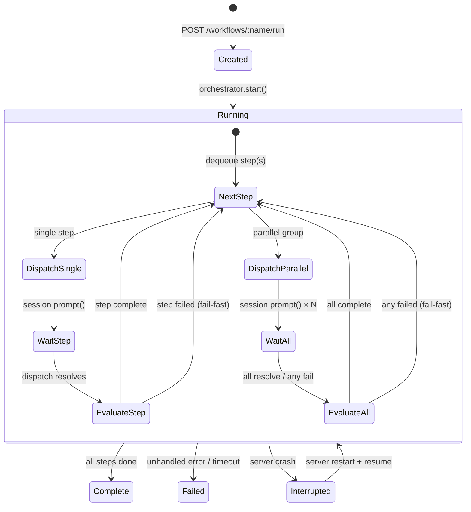
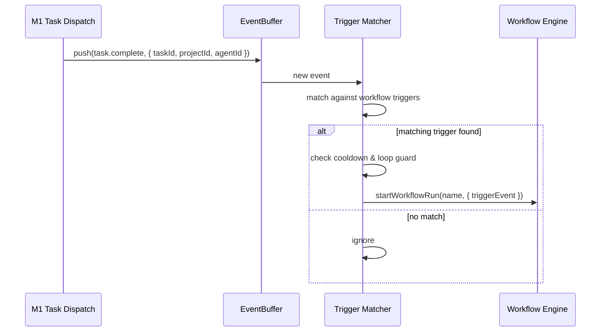

# feat: pragents M2 Orchestrate — Workflows & Skill Routing

## Summary

Build the M2 orchestration layer on top of M1: a Workflow Engine for sequential, parallel, and conditional multi-step agent workflows defined in `workflows/*.yaml`, Skill-based routing (keyword matching + LLM fallback) to dispatch tasks to the right agent, and Event-triggered workflow starts hooked into M1's EventBuffer. M1 is extended with task lifecycle events (`task.running`, `task.complete`, `task.failed`) and `dispatch()` now returns the agent's response text for step output forwarding.

---

## Problem Frame

M1 gave us isolated tasks — every task runs alone, manually dispatched. For a one-person agency, recurring processes like "Research → Draft → SEO → Publish" require four manual dispatches and the user must remember sequencing. M2 composes tasks into workflows that the system executes autonomously, routes tasks to the correct agent based on skills, and starts follow-up workflows automatically when events fire.

---

## Requirements

- **R1.** Workflows as separate `workflows/*.yaml` files, one workflow per file, with `name`, optional `description`, and `steps`
- **R2.** Steps have `id`, `agent` (agent ID or routing rule), `prompt`, optional `input` (previous step output), optional `output`, optional `timeout`
- **R3.** Steps: sequential (default), parallel (concurrent dispatch), conditional (`condition` field evaluating step outputs)
- **R4.** Step output forwarding: agent response text passed as context to dependent steps via `input: step_id`
- **R5.** Workflow state in SQLite (`workflow_runs`, `workflow_steps` tables) — survives server restart
- **R6.** Timeouts: per-step and per-workflow, exceeding → step/run marked `failed`
- **R7.** Manual trigger: `POST /api/v1/workflows/:name/run` with optional `params`
- **R8.** Event trigger: workflows define `trigger.event` + optional `filter`; M1 EventBuffer events start matching workflows
- **R9.** Agent skills in `pragents.yaml` (existing from M1)
- **R10.** Skill routing: keyword matching primary (task text → agent skill tags), LLM fallback for ambiguous cases (0 or >1 match)
- **R11.** Routing results deterministic (keyword) or logged (LLM fallback)
- **R12.** Steps can specify `agent: { route_by: "skills", prefer: ["typescript"] }` instead of fixed agent ID
- **R13.** REST: `GET /api/v1/workflows`, `GET /api/v1/workflows/:name`, `POST /api/v1/workflows/:name/run`, `GET /api/v1/workflows/runs`, `GET /api/v1/workflows/runs/:id`
- **R14.** Workflow events in EventBuffer → Web UI Activity Stream
- **R15.** Web UI "Workflows" tab with workflow list, run history, live step status

**Origin actors:** A1 (User), A2 (Orchestrator), A3 (Agents)
**Origin flows:** F1 (Manual Start), F2 (Sequential), F3 (Parallel), F4 (Conditional), F5 (Skill Routing), F6 (Event Trigger)
**Origin acceptance examples:** AE1 (Content Pipeline), AE2 (Parallel Steps), AE3 (Conditional Branch), AE4 (Skill Routing), AE5 (Event Trigger)

---

## Scope Boundaries

### In Scope
- Workflow Engine: sequential, parallel, conditional
- Workflow definition: `workflows/*.yaml` (separate files)
- Skill routing: keyword + LLM fallback
- Triggers: manual (API) + event-based
- Workflow state: SQLite + crash recovery
- REST API + Web UI tab

### Deferred to M2.5
- NL Delegation (LLM task decomposition)
- Plan Review UI

### Deferred to Follow-Up Work

- Cron scheduler (M3+)
- Quality Gates, Human Gates (M4+)
- Workflow UI Editor, Escalation (M5+)
- Hot-reload for workflow files (server restart required in M2)

---

## Context & Research

### Relevant Code and Patterns (from M1)

- **`AgentSessionManager`** (`server/src/agents/manager.ts`): `dispatch()` currently returns `void`; M2 extends to `Promise<string>`. Lazy session creation via `getOrCreate()`. Session lifecycle managed via `disposeIdle()`.
- **`EventBuffer`** (`server/src/events/buffer.ts`): Ring buffer, `push()` + `getSince()` + `getRecent()`. No filtering. Used by WebSocket gateway.
- **`TaskTracker`** (`server/src/tasks/tracker.ts`): Task CRUD + lifecycle + `recoverStaleTasks()`. Pattern to follow for `WorkflowTracker`.
- **`createTasksRoute`** (`server/src/api/routes/tasks.ts`): Hono route factory receiving dependencies. Pattern to follow for workflow routes.
- **Config system** (`server/src/config/schema.ts`, `loader.ts`): Zod validation + `loadConfig()`. Pattern for workflow YAML loading.

### External References

- Anthropic "Building Effective Agents" (Dec 2024): Router pattern, "start simple" recommendation
- AutoGen GroupChat, LangGraph Supervisor, OpenAI Swarm: LLM-based agent routing patterns
- Semantic Router library: Embedding-based routing as potential future upgrade path

---

## Key Technical Decisions

- **M1 integration: extend `dispatch()` + add task lifecycle events.** `dispatch()` returns `Promise<string>` (agent response text). Task state transitions (`running`, `complete`, `failed`) pushed to EventBuffer. ~20 lines changed, no new components. *(see origin: docs/brainstorms/2026-05-07-pragents-m2-orchestrate-requirements.md, Key Decisions)*

- **Workflow format: separate `workflows/*.yaml` files.** One file per workflow, Zod-validated at startup. Scales to 20+ workflows, git-trackable per workflow, no config file contamination. *(see origin: Team-Debatte architect/devops/pragmatist)*

- **Skill routing: keyword matching + LLM fallback.** Keyword match of task text against agent skill tags (from `pragents.yaml`). LLM fallback when ambiguous (0 or >1 matches). Industry standard (Anthropic "start simple"). Deterministic primary path, flexible fallback.

- **Agent queuing: serialize per-agent dispatches.** When parallel steps target the same agent, the orchestrator queues — only one task runs per agent at a time. Prevents file conflicts from concurrent SDK sessions in the same working directory.

- **Condition DSL: simple expression evaluator.** `step_id.field == value` syntax, evaluated against a serialized run state object. No `eval()` — use a restricted parser. Supports equality, inequality, and existence checks.

- **Loop prevention: source run ID tracking.** Event-triggered workflows tag their created tasks with `source_workflow_run_id`. The trigger skips events originating from the same workflow run. Configurable cooldown (default 60s) prevents rapid re-triggering.

---

## Open Questions

### Resolved During Planning

- **M1→M2 Event integration:** Extend M1's `dispatch()` to return `Promise<string>` and push `task.*` lifecycle events to EventBuffer. Resolved by specialist team (m1-expert/architect/pragmatist).
- **Agent concurrency (parallel steps → same agent):** Queue per agent. Only one active task per agent. Resolved: fail-fast for parallel group if any step fails.
- **Step output format:** Agent's text response from `dispatch()`. Stored as `TEXT` in `workflow_steps.output`. Subsequent steps receive it prepended to their prompt.
- **Workflow format:** Separate `workflows/*.yaml` files. Resolved by specialist team.

### Deferred to Implementation

- **LLM fallback model selection:** Use cheapest model among configured agents (Haiku if present, else PM agent's model). Exact selection logic deferred.
- **Condition DSL implementation:** Exact parser choice (custom vs jsonpath vs library) deferred to implementation.
- **Workflow file hot-reload:** Deferred to M3+. M2 requires server restart for workflow changes.
- **Timeout granularity and enforcement mechanism:** Seconds as unit, per-step `setTimeout`. Exact implementation deferred.

---

## High-Level Technical Design

> *This illustrates the intended approach and is directional guidance for review, not implementation specification. The implementing agent should treat it as context, not code to reproduce.*

### Workflow Execution State Machine

### Event Trigger Flow

---

## Implementation Units

### U1. M1 Integration — Task Lifecycle Events & Output Capture

**Goal:** Extend M1's `AgentSessionManager.dispatch()` to return the agent's text response, and push task lifecycle events (`task.running`, `task.complete`, `task.failed`) into EventBuffer.

**Requirements:** R4 (step output), R8 (event trigger foundation), R14 (workflow events)

**Dependencies:** None (M1 codebase exists)

**Files:**
- Modify: `server/src/agents/manager.ts` — `dispatch()` return type `void` → `Promise<string>`
- Modify: `server/src/api/routes/tasks.ts` — add `eventBuffer` parameter, push lifecycle events
- Modify: `server/src/index.ts` — pass `eventBuffer` to tasks route
- Test: `server/src/agents/__tests__/manager.test.ts`, `server/src/api/__tests__/tasks.test.ts`

**Approach:**
- `dispatch()` already awaits `session.prompt()` — capture and return the response text. The SDK's prompt resolution includes the agent's final message.
- `tasks.ts` route already calls `tracker.setComplete()` in `.then()` — add `eventBuffer.push()` with `task.complete` event containing `{ taskId, result }`
- Same for `.catch()`: push `task.failed` with `{ taskId, error }`
- Also push `task.running` when task is dispatched
- `createTasksRoute` signature extended to accept `eventBuffer: EventBuffer`

**Patterns to follow:**
- Existing `eventBuffer.push(projectId, agentId, type, data)` pattern
- Existing route factory pattern: `createTasksRoute(tracker, agents, sessionMgr, eventBuffer)`

**Test scenarios:**
- Happy path: Dispatch task → verify `dispatch()` returns non-empty string (agent response)
- Happy path: Dispatch task → verify `task.running`, `task.complete` events in EventBuffer
- Happy path: Verify `task.complete` event contains `taskId` and `result`
- Error path: Dispatch to invalid agent → verify `task.failed` event in EventBuffer
- Integration: Existing M1 tests still pass after signature change

**Verification:**
- `dispatch()` returns agent text response
- EventBuffer contains `task.running`, `task.complete`, `task.failed` events with correct task IDs

---

### U2. Workflow Schema & YAML Loader

**Goal:** Define the Zod schema for workflow YAML files, implement file discovery and loading from `workflows/*.yaml`, and create the SQLite migration for `workflow_runs` and `workflow_steps` tables.

**Requirements:** R1, R2, R3 (schema), R5 (SQLite tables)

**Dependencies:** U1 (EventBuffer events needed for trigger validation)

**Files:**
- Create: `server/src/workflows/schema.ts` — Zod schema for WorkflowDef, WorkflowStep, TriggerConfig
- Create: `server/src/workflows/loader.ts` — File discovery, YAML parsing, validation, WorkflowRegistry
- Create: `server/src/db/migrations/002_workflows.sql` — `workflow_runs`, `workflow_steps` tables
- Create: `server/src/workflows/tracker.ts` — WorkflowTracker (CRUD for runs/steps, pattern from TaskTracker)
- Create: `workflows/example-pipeline.yaml` — Example workflow (content pipeline)
- Test: `server/src/workflows/__tests__/schema.test.ts`, `server/src/workflows/__tests__/loader.test.ts`

**Approach:**
- **Zod schema**: `WorkflowStep` with `id`, `agent` (string | `{ route_by, prefer }`), `prompt`, `input?`, `output?`, `timeout?`, `condition?`, `parallel?: WorkflowStep[]`. `WorkflowDef` with `name`, `description?`, `trigger?`, `steps[]`. `TriggerConfig` with `event`, `filter?`, `cooldown_ms?`.
- **Loader**: `readdirSync` on configured `workflows/` directory, glob `*.yaml`, parse + validate each. Return `WorkflowRegistry` (Map of name → validated definition). Log warnings for invalid files — don't crash server.
- **Tracker**: `WorkflowTracker` class with `createRun()`, `updateStep()`, `getRun()`, `listRuns()`, `recoverStaleRuns()`. Follows `TaskTracker` pattern exactly.
- **Migration**: `workflow_runs` (id, workflow_name, status, params, trigger_source_run_id, started_at, completed_at), `workflow_steps` (id, run_id, step_id, agent_id, status, output, started_at, completed_at).

**Patterns to follow:**
- `TaskTracker` for tracker design
- `loadConfig()` for YAML loading and Zod validation
- M1 migration `001_initial.sql` for migration format

**Test scenarios:**
- Happy path: Valid workflow YAML parses successfully, all fields populated
- Happy path: Workflow with parallel steps validates
- Happy path: Workflow with `agent: { route_by: "skills", prefer: [...] }` validates
- Happy path: `WorkflowTracker.createRun()` persists to SQLite
- Edge case: Missing `name` field → Zod validation error, logged as warning
- Edge case: Duplicate step IDs → validation error
- Edge case: `input` references non-existent step ID → validation warning (runtime-safe, warn at load)
- Edge case: `workflows/` directory empty → empty registry, no error
- Error path: Invalid YAML syntax → logged warning, file skipped, server continues
- Integration: Migration `002_workflows.sql` runs on startup, tables exist

**Verification:**
- Example `workflows/example-pipeline.yaml` loads and validates
- Invalid YAML files produce warnings but don't crash server
- `WorkflowTracker` CRUD operations work against SQLite

---

### U3. Workflow Engine

**Goal:** Implement the core workflow execution engine: state machine for sequential, parallel, and conditional step execution, output forwarding, timeout handling, and crash recovery.

**Requirements:** R3, R4, R5, R6, R8 (event trigger execution), AE1-AE3

**Dependencies:** U1 (dispatch returns output), U2 (schema, loader, tracker)

**Files:**
- Create: `server/src/workflows/engine.ts` — Orchestrator: start, execute, resume
- Create: `server/src/workflows/trigger-matcher.ts` — Event trigger matching and dedup
- Create: `server/src/workflows/condition-eval.ts` — Restricted expression evaluator
- Test: `server/src/workflows/__tests__/engine.test.ts`, `server/src/workflows/__tests__/trigger-matcher.test.ts`

**Approach:**
- **Engine**: `Orchestrator.start(workflowName, params?)` creates a run, iterates steps. For each step group: if `parallel` array → dispatch all concurrently, wait for all (fail-fast if any fail). Else → dispatch single step. After step completes, evaluate `condition` if present → follow matching branch. Forward step output to dependent next steps via `input` template injection. On timeout → mark step `failed`, workflow `failed`.
- **Trigger matcher**: Subscribe to EventBuffer events (poll or hook). For each event, check against registered workflow triggers: event type matches, optional `filter.agentId`/`filter.projectId` matches. Cooldown check (last trigger < cooldown_ms ago → skip). Loop guard (trigger_source_run_id in event data → skip). If all pass → `orchestrator.start()`.
- **Condition evaluator**: Parse `step_id.field == value` expressions. Build a state object `{ steps: { [id]: { status, output } }, params: {} }`. Resolve dotted paths. Support `==`, `!=`, `>`, `<`. No `eval()`.
- **Crash recovery**: On startup, `WorkflowTracker.recoverStaleRuns()` finds runs with status `running`. For each: find steps with status `running` or `pending` — re-execute from first incomplete step. Steps with status `complete` have persisted outputs — reuse them.
- **Agent queuing**: Before dispatching to an agent, check if that agent already has a `running` step in ANY active workflow run. If yes, queue the step until the agent is free.

**Patterns to follow:**
- `TaskTracker.recoverStaleTasks()` for recovery pattern
- `AgentSessionManager.getOrCreate()` for session reuse logic
- Promise.all for parallel dispatch, Promise.race for fail-fast

**Test scenarios:**
- Happy path: 3-step sequential workflow (Research → Draft → Publish) executes end-to-end
- Covers AE1: Full content pipeline runs without manual intervention
- Happy path: Parallel steps A and B dispatch simultaneously, both complete, workflow continues
- Covers AE2: Parallel steps run concurrently
- Happy path: Step output from step 1 injected into step 2's prompt
- Happy path: Conditional step evaluates `steps.draft.status == 'complete'` → follows then-branch
- Covers AE3: Conditional branching works
- Happy path: Workflow timeout exceeded → run status `failed`, in-progress steps cancelled
- Edge case: Parallel group with same agent → steps run sequentially (queued, not parallel)
- Edge case: Empty steps array → run completes immediately
- Edge case: Condition references skipped step (conditional branch not taken) → condition evaluates to false
- Error path: Step dispatch fails (agent error) → step `failed`, workflow `failed` (fail-fast)
- Integration: Crash recovery — simulate server crash mid-workflow, restart, verify resume from last completed step

**Verification:**
- 3-step sequential workflow completes with correct output forwarding
- Parallel steps dispatch concurrently, workflow waits for all
- Conditional step follows correct branch based on output
- After simulated crash + restart, interrupted workflow resumes from last complete step

---

### U4. Skill Router

**Goal:** Implement skill-based agent routing: keyword matching of task text against agent skill tags, with LLM fallback for ambiguous cases.

**Requirements:** R9, R10, R11, R12, AE4

**Dependencies:** U2 (workflow schema supports `route_by`), U3 (engine calls router for routing steps)

**Files:**
- Create: `server/src/routing/router.ts` — SkillRouter: match, resolve
- Create: `server/src/routing/llm-fallback.ts` — LLM-based agent selection
- Test: `server/src/routing/__tests__/router.test.ts`

**Approach:**
- **Keyword matching**: Tokenize task prompt text (lowercase, split on non-alphanumeric). Intersect with each agent's skill tags (from resolved `ResolvedAgent.skills`). Agent with most keyword matches wins. If exactly one agent has matches → return that agent. If tie or zero → fall back to LLM.
- **LLM fallback**: Construct prompt: "Given this task and these agents with their skills, which agent should handle it? Respond with only the agent ID." Send to cheapest available model (find Haiku-configured agent, else use PM agent's model). Parse response for exact agent ID match. On LLM failure → return first keyword-matched agent, or default to `dev@<projectId>`.
- **Router interface**: `SkillRouter.resolveAgent(task: string, projectId: string, prefer?: string[]): Promise<string>` — returns agent ID.
- **Deterministic logging**: Every routing decision logged with `{ task, matches, selected, method: 'keyword' | 'llm_fallback' }`.

**Patterns to follow:**
- M1's `resolveAllAgents()` for loading agent data from config
- Simple tokenization (no NLP library dependency)

**Test scenarios:**
- Happy path: Task "Fix TypeScript type error" → keyword matches `typescript` → routes to `dev@project` (has TypeScript skill)
- Covers AE4: Task correctly routed based on skills
- Happy path: Task "Optimize meta tags for SEO" → matches `technical-seo` → routes to SEO agent
- Happy path: Task with zero keyword matches → LLM fallback called → returns valid agent ID
- Happy path: Task matching multiple agents equally → LLM fallback called → returns single agent ID
- Edge case: Task text is empty → fallback to default agent for project
- Edge case: No agents configured for project → clear error
- Error path: LLM fallback call fails (timeout) → returns first keyword match or default agent
- Error path: LLM returns invalid agent ID → logged warning, uses default agent

**Verification:**
- Keyword routing correctly matches 5 different task types to correct agents
- LLM fallback invoked only when keyword matching is ambiguous
- Invalid LLM responses handled gracefully with fallback

---

### U5. REST API & Web UI — Workflows Tab

**Goal:** Add workflow REST endpoints, workflow events to WebSocket/EventBuffer, and a "Workflows" tab in the Web UI.

**Requirements:** R7, R13, R14, R15

**Dependencies:** U1-U4 (all prior units)

**Files:**
- Create: `server/src/api/routes/workflows.ts` — Hono route factory
- Modify: `server/src/index.ts` — mount workflow routes, wire EventBuffer to TriggerMatcher
- Modify: `web/src/main.tsx` — add Workflows tab + views
- Test: `server/src/api/__tests__/workflows.test.ts`

**Approach:**
- **REST API**: `GET /api/v1/workflows` (list loaded definitions), `GET /api/v1/workflows/:name` (single definition), `POST /api/v1/workflows/:name/run` (start, returns run ID), `GET /api/v1/workflows/runs` (history), `GET /api/v1/workflows/runs/:id` (detail with step statuses)
- **Event flow**: Workflow events (`workflow.step_started`, `workflow.step_completed`, `workflow.step_failed`, `workflow.completed`, `workflow.failed`) pushed to EventBuffer via existing `push()` pattern
- **Web UI**: New "Workflows" tab in navigation. Three sub-views: Workflow list (available workflows with "Run" button), Run history (past runs with status), Active run detail (live step status, polling every 3s)
- No workflow YAML editor in M2 — files are edited externally

**Patterns to follow:**
- `createTasksRoute` factory pattern for workflow routes
- Dashboard tab pattern (same as Dashboard/Traces/Tasks)
- Polling refetchInterval pattern (3-5s) for live step status

**Test scenarios:**
- Happy path: `GET /api/v1/workflows` returns list of loaded workflow names
- Happy path: `POST /api/v1/workflows/content-pipeline/run` → 201, returns run ID
- Happy path: `GET /api/v1/workflows/runs/:id` shows step statuses
- Happy path: Web UI Workflows tab shows workflow list with "Run" buttons
- Happy path: Active run detail updates step status in real-time
- Edge case: POST run for non-existent workflow → 404
- Edge case: `GET /api/v1/workflows` with no workflows loaded → empty array
- Integration: Triggering a workflow via API → events appear in Web UI Activity Stream

**Verification:**
- All REST endpoints return correct responses
- Web UI Workflows tab accessible and functional
- Workflow events visible in Activity Stream
- Manual workflow run via API executes successfully

---

## System-Wide Impact

- **Interaction graph:** M1's `AgentSessionManager.dispatch()` signature change affects `tasks.ts` route and any future consumers. Workflow events flow into M1's existing EventBuffer → WebSocket → Web UI. Skill Router reads agent data from config (no change needed). WorkflowTracker writes to new SQLite tables.
- **Error propagation:** Step failures cascade per fail-fast policy (any parallel step failure fails the group and workflow). Dispatch errors caught in engine, step marked `failed`, workflow evaluation continues (if sequential) or aborts (if parallel). Event trigger errors logged, don't affect M1 task dispatch.
- **State lifecycle risks:** `workflow_runs` + `workflow_steps` must be written transactionally during execution. Crash recovery marks stale `running` runs/steps. Parallel step outputs persisted before proceeding to next group. Agent queuing prevents race conditions from concurrent dispatches to same agent.
- **API surface parity:** Workflow REST endpoints follow M1 patterns (Hono route factories, JSON responses). EventBuffer events for workflows follow same `{ type, projectId, agentId, data, timestamp }` format as M1 events.
- **Integration coverage:** The `task.complete` event → TriggerMatcher → Orchestrator.start → Engine.execute chain is the critical cross-layer path requiring integration testing. Unit tests alone cannot verify the full trigger-to-execution flow.
- **Unchanged invariants:** M1's `TaskTracker` unchanged. `pragents.yaml` config format unchanged. `AgentSessionManager` core session management unchanged (only `dispatch()` return type). Web UI Dashboard/Traces/Tasks tabs unchanged.

---

## Risks & Dependencies

| Risk | Mitigation |
|------|------------|
| `dispatch()` signature change breaks existing M1 consumers | Only `tasks.ts` consumes `dispatch()` today. Change is additive (wider return type). All existing M1 tests pass after change. |
| LLM fallback call fails (rate limit, timeout) | Fallback to first keyword match or default agent. Logged as warning. Not a blocking failure. |
| Parallel steps on same agent cause file conflicts | Agent queuing: orchestrator serializes dispatches to same agent. Only one active dispatch per agent. |
| Event-triggered workflow loops (A triggers B triggers A) | Loop guard: tasks tagged with `source_workflow_run_id`. Triggers skip events from same run. Cooldown (60s default). |
| Workflow YAML changes require server restart | Documented limitation. Hot-reload deferred to M3+. |
| pi SDK `prompt()` response format changes | Capture strategy is generic (final text response). If SDK changes format, only one line of extraction code needs updating. |

---

## Documentation / Operational Notes

- Example workflow committed: `workflows/example-pipeline.yaml` demonstrating sequential, parallel, and conditional steps
- Workflow YAML authoring guide in `docs/workflows.md`
- After server restart, stale workflow runs auto-recover (same pattern as task recovery)
- Event trigger cooldown and loop guard are configurable per workflow definition

---

## Sources & References

- **Origin document:** [docs/brainstorms/2026-05-07-pragents-m2-orchestrate-requirements.md](../brainstorms/2026-05-07-pragents-m2-orchestrate-requirements.md)
- **M1 Plan:** [docs/plans/2026-05-07-001-feat-pragents-m1-core-plan.md](../plans/2026-05-07-001-feat-pragents-m1-core-plan.md)
- **Design Spec:** [docs/superpowers/specs/2026-05-06-pragents-design.md](../superpowers/specs/2026-05-06-pragents-design.md) — M2 scope, workflow YAML format, skill routing
- **Team decisions:** Event integration (m1-expert/architect/pragmatist), Workflow format (architect/devops/pragmatist)
- External: Anthropic "Building Effective Agents", AutoGen GroupChat, LangGraph Supervisor, OpenAI Swarm
